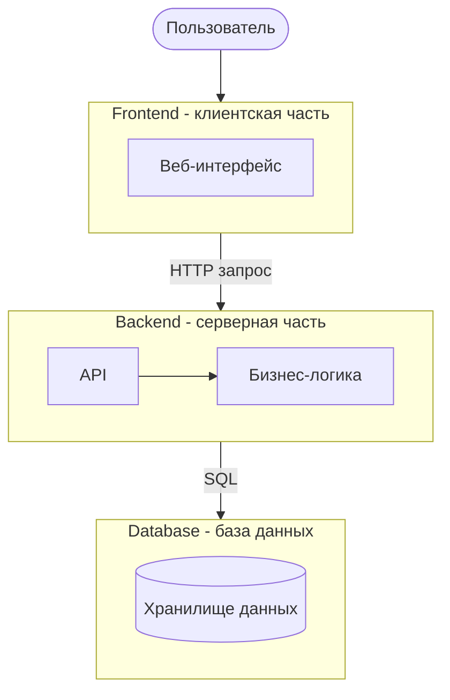

# Лабораторная работа №3. Проектирование архитектуры информационной системы

---

## Цель работы

Изучить принципы проектирования архитектуры информационных систем, определить структуру приложения, спроектировать взаимодействие между основными компонентами и подготовить структуру программного проекта для дальнейшей разработки.

---

##  Шаг 1. Выбор архитектуры приложения

**Выбранный архитектурный стиль:** трёхуровневая (3-tier) архитектура веб-приложения.

| Уровень | Назначение |
|---|---|
| Frontend (клиентская часть) | Веб-интерфейс, с которым взаимодействует пользователь |
| Backend (серверная часть) | Обработка запросов, бизнес-логика, проверка прав доступа |
| Database (база данных) | Постоянное хранение данных |

**Преимущества выбранного подхода:**

- каждый уровень можно разрабатывать, тестировать и масштабировать независимо;
- чёткое разделение ответственности между интерфейсом, логикой и хранением данных;
- удобство сопровождения и развития системы.

**Тип приложения:** веб-приложение (клиент-серверная архитектура).

---

## Шаг 2. Компоненты системы

| Компонент | Назначение | Взаимодействие |
|---|---|---|
| Пользователь | Создаёт и отслеживает заявки | Использует веб-интерфейс |
| Веб-интерфейс (Frontend) | Предоставляет доступ к функциям системы через браузер | Передаёт запросы на Backend по HTTP |
| API (Backend) | Принимает и обрабатывает запросы от клиента | Взаимодействует с бизнес-логикой |
| Бизнес-логика | Реализует правила обработки заявок, назначение исполнителей, смену статусов | Обращается к базе данных |
| База данных | Хранит пользователей, заявки, оборудование, помещения, комментарии | Взаимодействует с бизнес-логикой по SQL |
| Модуль уведомлений | Отправляет пользователю Email/SMS при изменении заявки | Взаимодействует с внешним сервисом Email/SMS |

**Веб-интерфейс** обеспечивает создание заявок, просмотр их статусов, добавление комментариев, управление заявками и формирование отчётов.

**API** принимает HTTP-запросы от веб-интерфейса и передаёт их в бизнес-логику.

**Бизнес-логика** реализует основную логику системы: создание, обработку, назначение исполнителей и изменение статусов заявок.

**База данных** централизованно хранит все данные системы.

**Модуль уведомлений** отвечает за информирование пользователей о важных событиях (смена статуса, назначение исполнителя) через внешний сервис Email/SMS.

---

## Шаг 3. Взаимодействие компонентов

Последовательность обработки запроса пользователя:

1. Пользователь заполняет форму в веб-интерфейсе.
2. Веб-интерфейс отправляет HTTP-запрос на сервер.
3. Сервер обрабатывает запрос с помощью бизнес-логики.
4. При необходимости сервер обращается к базе данных для сохранения или чтения данных.
5. База данных возвращает результат.
6. Сервер формирует ответ и возвращает его клиенту.
7. Веб-интерфейс отображает результат пользователю.
8. При изменении статуса заявки сервер передаёт событие в модуль уведомлений, который отправляет Email/SMS.

### Диаграмма взаимодействия (Sequence Diagram)


---

## Шаг 4. Индивидуальная особенность предметной области

**Нетиповая особенность:** автоматическое уведомление пользователя об изменении статуса заявки и назначении исполнителя через внешний сервис Email/SMS.

**Почему это важно:** пользователь не должен постоянно проверять систему — он получает уведомление сразу, как только статус его заявки изменился. Это повышает прозрачность процесса обработки заявок.

**Отвечающий компонент:** *Модуль уведомлений* (взаимодействует с внешним сервисом Email/SMS).

**Отражение в архитектуре:** модуль уведомлений выделен как отдельный компонент серверной части и получает событие от бизнес-логики при изменении заявки.

---

## Шаг 5. Структура проекта

```
project/
├── frontend/
├── backend/
│   ├── controllers/
│   ├── services/
│   ├── repositories/
│   ├── models/
│   └── routes/
├── database/
├── docs/
└── README.md
```

---

## Шаг 6. Архитектурные схемы

### 6.1. Диаграмма архитектуры системы



### 6.2. Диаграмма взаимодействия

---

## 9. Описание API (домашняя доработка)

| Метод | URL | Назначение |
|---|---|---|
| POST | `/api/auth/login` | Аутентификация пользователя |
| GET | `/api/requests` | Список заявок |
| POST | `/api/requests` | Создание заявки |
| GET | `/api/requests/{id}` | Детали заявки |
| PUT | `/api/requests/{id}` | Изменение заявки |
| PUT | `/api/requests/{id}/status` | Изменение статуса заявки |
| POST | `/api/requests/{id}/comments` | Добавление комментария |
| GET | `/api/reports` | Формирование отчёта |


---

## Основные результаты работы

- определён архитектурный стиль — трёхуровневая архитектура;
- выделены компоненты frontend, backend и database, описана их ответственность;
- спроектировано взаимодействие компонентов (диаграмма последовательности);
- выявлена нетиповая особенность предметной области — уведомления об изменении заявки через Email/SMS; определён отвечающий за неё компонент — «Модуль уведомлений»;
- разработана структура каталогов проекта;
- подготовлены диаграмма архитектуры и диаграмма взаимодействия;
- оформлен Git-репозиторий с Markdown-документацией.

---

## Вывод

В ходе лабораторной работы №3 была спроектирована архитектура информационной системы «Система управления заявками на ремонт». Использование трёхуровневой архитектуры позволило разделить ответственность между клиентской частью, серверной логикой и базой данных. Отдельно выделена нетиповая особенность предметной области — модуль уведомлений, работающий с внешним сервисом Email/SMS. Подготовленная структура проекта и диаграммы могут быть использованы как основа для реализации системы в следующих лабораторных работах.
